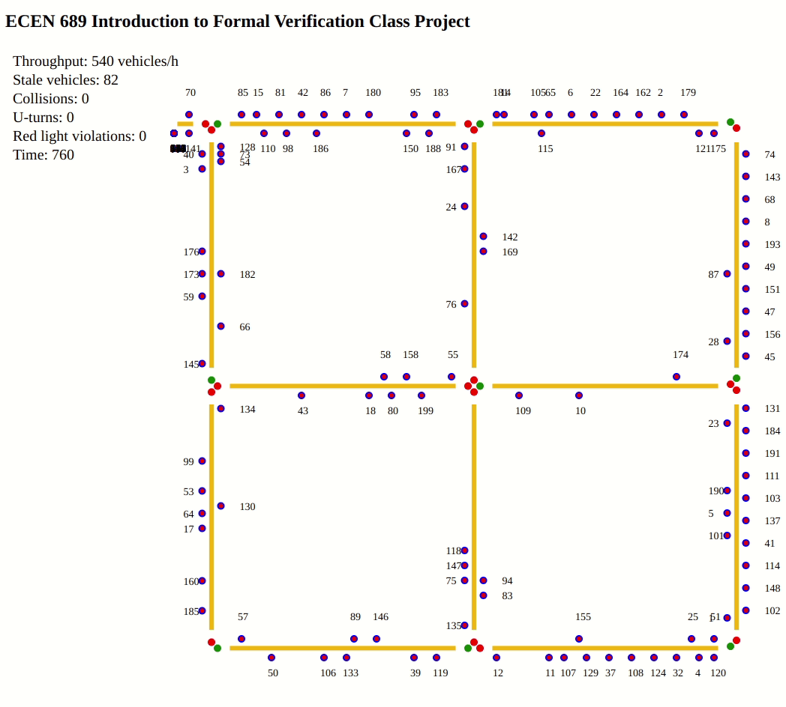

## Table of Contents

- [Table of Contents](#table-of-contents)
- [Map](#map)
- [Goal](#goal)
- [Constraints](#constraints)
- [Structure](#structure)
- [Technology Stack](#technology-stack)
- [Environment Setup](#environment-setup)
- [Location Encoding](#location-encoding)
- [Database](#database)
  - [Road Segment Record](#road-segment-record)
  - [Traffic Light Record](#traffic-light-record)
  - [Vehicle Record](#vehicle-record)
  - [Number of Vehicles](#number-of-vehicles)
  - [Database Structure](#database-structure)
- [Backend Workflow](#backend-workflow)
- [Vehicle Workflow](#vehicle-workflow)
- [Congestion Computation Workflow](#congestion-computation-workflow)
- [Traffic Light Control Workflow](#traffic-light-control-workflow)
- [Frontend Webpage Implementation](#frontend-webpage-implementation)
- [Model Checking](#model-checking)
- [Tutorials](#tutorials)


## Demo




## Map

```
====A Z =======E======= X =======F======= D
     | |               | |               | |
     | |               | |               | |
     | |               | |               | |
      G                 H                 I
     | |               | |               | |
     | |               | |               | | 
     | |               | |               | | 
      Y =======J======= U =======K======= W
     | |               | |               | |
     | |               | |               | |
     | |               | |               | |
      L                 M                 N
     | |               | |               | |
     | |               | |               | | 
     | |               | |               | | 
      B =======O======= V =======P======= C
```

Each vehicle must start from A, visit B, C, D in any order and leave at A.

A is not a crossroad. B, C and D are crossroads.

Each road segment has two lanes running in different directions.

Traffic signals are either red or green.


## Goal

Design and verify a simple traffic system.

All vehicles on the map start and finish at the same position.

All vehicles have the same constraints.

The infrastructure group develops the traffic light control system.

The vehicle group simulates the vehicles in the traffic system.

Maximize the number of vehicles completing the route per unit time.


## Constraints

Each road segment is divided into 30 slots.

Eacept road segment A, which has 2 slots only.

Each vehicle can move one slot at a time.

At any time instant, the same slot should have one vehicle. Otherwise, a collision happens.

Vehicles stop at a red signal and cannot make right turn.

Between two consecutive time steps, one vehicle can cross the road intersection.

At any time step, at the same intersection, only one signal can be green.

Vehicles at the intersection can see others at the intersection as well.

Vehicles have limited visibility along the same direction.

Vehicles can only move in the correct direction of the lane.

No U-turn.

Vehicles cannot move if another vehicle were immediately ahead of it.


## Structure

The code is divided into 3 groups: vehicle, backend and database.

Bonus part: a single page web application for viewing the traffic in real time.

The files are organized as the follows:

```
ECEN689_Formal_Verification_Project\    ----------> Root directory
    backend\    ----------------------------------> Python Flask backend
        app\
            templates\    ------------------------> Frontend webpage
            __init__.py    -----------------------> Backend startup routine
            routes.py    -------------------------> Backend routes
        congestion_computation\    ---------------> Threaded computation
            __init__.py    -----------------------> Export the folder as module
            congestion_computation.py    ---------> Compute congestion index
        location_speed_encoding\    --------------> Encodings for map and vehicles
            __init__.py    -----------------------> Export the folder as module
            crossroads.py    ---------------------> Crossroads
            direction.py    ----------------------> Lane directions
            map.py    ----------------------------> Road/crossroad interconnections
            road.py    ---------------------------> Roads
            route_completion_status.py    --------> Vehicle route completion status
            signal_light_positions.py    ---------> Traffic light orientations
            speed.py    --------------------------> Vehicle moving speeds
            traffic_light_sequence.py    ---------> Sequences for toggling traffic lights
            traffic_lights.py    -----------------> Traffic light status
        trafic_signal_control\    ----------------> Single thread signal light control
            __init__.py    -----------------------> Export the folder as module
            traffic_signal_control_master.py    --> Traffic light control
        vehicle\    ------------------------------> One vehicle object per thread
            __init__.py    -----------------------> Export the folder as module
            vehicle.py    ------------------------> Vehicle implementation
        .flaskenv    -----------------------------> Python flask environment variables
        backend.py    ----------------------------> Flask app
        config.py    -----------------------------> Flask app configurations
        run_threads.py    ------------------------> Start vehicle and congestion computation
    .gitignore    --------------------------------> Used by Git to exclude files
    verification\   ------------------------------> Promela and Spin model checking
        lock.h    --------------------------------> Mutex macros
        main.pml    ------------------------------> Main Promela code
        run_spin.sh    ---------------------------> Run verification code
    README.md    ---------------------------------> Documentation
    requirements.txt    --------------------------> Python library requirements
```


## Technology Stack

Python + Flask + Redis + HTML + JavaScript + CSS


## Environment Setup

Ensure **Python 3** and **virtualenv** is installed.

For the first time setup, clone the code, change into the root directory of the code folder, then run:

``python3 -m venv venv``

``source venv/bin/activate``

``pip install -r requirements.txt``

Install [Redis](https://redis.io/topics/quickstart). Remember to copy **redis-server** and **redis-cli** to ``/usr/local/bin/``.

Once the environemt is setup, anytime one wants to activate the virtual environemnt, run:

``source venv/bin/activate``

To start the backend, change directory to **backend**, then run:

``flask run``

To start vehicle and congestion threads, change directory to **backend**, then run:

``python run_threads.py``

Remember to start **Redis** with:

``redis-server``

The connection information such as **port number** is shown in the terminal.

Commands to start backend, threads and Redis database should run in separate terminals.

Restart the computer or the virtual machine if things do not work after first time environment configuration.


## Location Encoding

Each road segment has a name.

Each road segment has two lanes: the right lane and the left land.

Encoding order: road segment -> lane direction -> square position.

Square position:

```
     29                   0  
     ======================
0  | |                    
   | |                   
   | |                
   | |                 
   | |                 
   | |                
   | |                
29 | |                
```

When a vehicle is moving from square 0 to square 29 on the same road segment, the vehicle is said to be on the right lane.

When a vehicle is moving from square 29 to square 0 on the same road segment, the vehicle is said to be on the left lane.

The map is encoded in a dictionary with the following format.

```
{
    <road_name>: {
        Direction.DIRECTION_LEFT: {
            "crossroad": <crossroad_in_this_direction>,
            "traffic_light_orientation": <traffic_light_orientation_to_query>
        },
        Direction.DIRECTION_RIGHT: {
            "crossroad": <crossroad_in_this_direction>,
            "traffic_light_orientation": <traffic_light_orientation_to_query>
        },
    },
    ...
    ...
    <crossroad_name>: {
        <traffic_light_orientation>: <road_segment_at_this orientation>,
        ...
    }
    ...
    ...
}
```

Each lane on the same road segment has an assigned crossroad and traffic light orientation to check.


## Database

All records are in JSON/Python dictionary format.


### Road Segment Record

```
<road_segment_name>: {
    direction_name<right>: {
        "vehicles": {
            <vehicle_name>: {
                "vehicle_location": <vehicle_location>,
                "vehicle_speed": <vehicle_speed>
            }
        },
        "congestion_index": <computed_value>
    },
    direction_name<left>: {
        "vehicles": {
            <vehicle_name>: {
                "vehicle_location": <vehicle_location>,
                "vehicle_speed": <vehicle_speed>
            }
        },
        "congestion_index": <computed_value>
    }
}
```


### Traffic Light Record

```
JSON format:
<crossroad_name>: {
    <signal_light_position>: <traffic_light_color>,
    ...
}
```


### Vehicle Record

```
<vehicle_name>: {
    "road_segment": <road_segment_name>,
    "direction": <direction_name>,
    "location": <location_on_the_segment>,
    "speed": <speed>,
    "route_completion": <yes_no_not_started>
}
```

### Number of Vehicles

```
"vehicles": <number_of_vehicles_in_the_system>,
"pending_vehicles": <number_of_vehicles_waiting_to_enter_the_system>
```


### Database Structure

**Redis** is primarily a key-value pair database system. Compared with any SQL based database system such as **MySQL**, which has a strict on the structure, **Redis** allows more flexibility. The content in **Redis** used by the project is listed below.


```
"ROAD_A": <road_segment_record>,
"ROAD_B": <road_segment_record>,
"ROAD_C": <road_segment_record>,
"ROAD_D": <road_segment_record>,
...
...
"CROSSROAD_A": <traffic_light_record>,
"CROSSROAD_B": <traffic_light_record>,
"CROSSROAD_C": <traffic_light_record>,
"CROSSROAD_D": <traffic_light_record>,
...
...
"VEHICLE_1": <vehicle_record>,
"VEHICLE_2": <vehicle_record>,
"VEHICLE_3": <vehicle_record>,
"VEHICLE_4": <vehicle_record>,
...
...
"vehicles": <number_of_vehicles_in_the_system>,
"pending_vehicles": <number_of_vehicles_waiting_to_enter_the_system>
"vehicle_collisions": <number_of_collisions>
"u_turns": <number_of_u_turns>
"throughput": <number_of_vehicles_finished_route_within_past_120_seconds>
"red_light_violation": <number_of_red_light_violations>
```


## Backend Workflow

The backend uses Python Flask as the framework and implements the following APIs:

| Route                                                                       
|--------------------------------------------------------------|
| ``/query_signal_light/<intersection>``                       |
| ``/set_signal_light``                                        | 
| ``/query_vehicle_status/<vehicle_id>``                       | 
| ``/set_vehicle_status/<vehicle_id>``                         | 
| ``/query_road_congestion/<road_id>/<direction>``             | 
| ``/set_road_congestion/<road_id>``                           |
| ``/query_location/<road_id>/<direction>``                    |
| ``/add_vehicle/<vehicle_id>``                                |

Threads report updated information with HTTP POST method. The payload is in JSON format, as shown in [Database](#database).

The route names are fairly self-explanatory. The ``/query_location`` route is used to get the vehicle records at any road segment.

When ``<vehicle_id>`` in ``/query_vehicle_status/<vehicle_id>`` equals the total number of vehicles, all vehicle records are returned. U-turn, collision, throughtput and red light violations are also returned.

When ``intersection`` in ``/query_signal_light/<intersection>`` equals the total number of crossroads, all crossroad signal light records are returned.

If any vehicle thread or congestion computation thread queries the backend, the backend gets information from the database and returns to the querying threads.

If any thread sends the updated information to the backend, the backend will temporarily hold the information until all threads have reported. After all the information is gathered, the backend will temporarily block all requests, update the database then resume operation.

To ensure data consistency, all operations to the database are protected with mutex, including queries.


## Vehicle Workflow

Each vehicle is a single thread:

1. Ask for permission to enter the map.
2. If permission granted, start on road segment A.
3. If not, retry.
4. Ask for traffic light status if at the crossroad.
5. Ask for whether there are any vehicles ahead.
6. Make movement decision.
7. Send the movement decision to the backend.
8. Once the vehicle completes the route and exits, it resets its location and route completion status and restarts.

The number of vehicles is fixed.

All vehicles compete against each other to get into the traffic system to complete the route.

Vehicles will search for all possible combinations of routes starting from the current road segment for up to the next 6 possible road segments. Among those routes, the ones that reach the target crossroad are ranked according to route length. The shortest one is picked. If multiple shortest route exists, pick randomly.


## Congestion Computation Workflow

Each congestion computation thread is responsible for one road segment, not the whole road:

1. Ask for vehicles on the road at give location.
2. Update the local road segment data.
3. Compute the congestion index.
4. Send the updated congestion index to the backend.
5. Once the backend has acknowledged the update, go to the next iteration.

The number of congestion computation threads is fixed, because the map does not change. 

The number of road segments is also fixed.

Currently, the congestion index is simply how many vehicles there are on either lanes of the road segment.


## Traffic Light Control Workflow

Current implementation is to have the traffic lights toggled at fixed sequence and fixed time interval.

One single thread exists for doing traffic light control.

Ideally, the traffic light control workflow should be the following.

1. Ask for road congestion information.
2. Check where there are any vehicles at the cross roads.
3. Make decision on changing the traffic lights.
4. Send the updated traffic light status to the backend.
5. Wait for the backend to acknowledge, go to the next iteration.


## Frontend Webpage Implementation

The frontend page polls the backed at fixed time interval to get vehicle and traffic light status.

Once the backend responses, the front page adjusts vehicle positions and traffic lights.

Open the developer tool in any browser and change to the console. The number of vehicles that are waiting to enter the map is printed out in the console.


## Model Checking

The project uses [Spin](http://spinroot.com/spin/whatispin.html) for verifying the integerity of the application.

[Spin](http://spinroot.com/spin/whatispin.html) is a verification tool for multi-threaded software that suits our design of the traffic simulation software.

iSpin is one of the GUIs for [Spin](http://spinroot.com/spin/whatispin.html) and requires Tck/Tk and wish to use.

After installing both [Spin](http://spinroot.com/spin/whatispin.html) and iSpin, remember to copy both binaries to  ``/usr/local/bin`` for easy access from terminals.

``Examples/`` folder from the [Spin](http://spinroot.com/spin/whatispin.html) source code should be looked into to get familiarized with Promela syntax.

THe verification tool replies on a modeling language called Promela.

The verification replies on re-writing the application in Promela, including the constraints such as no collision or U-turn.

The communication between threads and the backend can be modeled with communication channels in Promela.

In other words, ``route`` in Python Flask is equivalent to ``chan`` in Promela.

One ``proctype`` definition corresponds to one thread or one process.

The mutex locking behaviour, though has no direct implementation in Promela, can be modeled with macros from this [post](https://lwn.net/Articles/243851/):

```
#define spin_lock(mutex) \
  do \
  :: 1 -> atomic { \
      if \
      :: mutex == 0 -> \
        mutex = 1; \
        break \
      :: else -> skip \
      fi \
    } \
  od
 
#define spin_unlock(mutex) \
  mutex = 0
```

To run the verification code, change directory to ``verification/`` and run ``run_spin.sh``.

If one wishes to simply run the code, type ``spin -c main.pml`` in ``verification/``.

Running model checking code written in Promela with Spin can take a long time and need huge memory, compile-time options can help reduce memory usage while maintain a reasonable speed.

Compile the Promela code with ``-DNCORE=N`` (``N`` being the number of cores assigned) to allow multi-core verification for speedup.

Compile the Promela code with ``-DBITSTATE`` to reduce memory usage.


## Tutorials

[The Flask Mega-Tutorial](https://blog.miguelgrinberg.com/post/the-flask-mega-tutorial-part-i-hello-world) by Miguel Grinberg.

[Flask's Documentation](https://flask.palletsprojects.com/en/2.0.x/)

[Python - Multithreaded Programming](https://www.tutorialspoint.com/python/python_multithreading.htm).

[Object-Oriented Programming (OOP) in Python 3](https://realpython.com/python3-object-oriented-programming/)

[Verifying Multi-threaded Software with Spin](http://spinroot.com/spin/whatispin.html)
[Using Promela and Spin to verify parallel algorithms](https://lwn.net/Articles/243851/)

[SPIN README](http://spinroot.com/spin/Man/README.html)

[Spin GitHub](https://github.com/nimble-code/Spin)

[Tcl Developer Xchange](https://www.tcl.tk/software/tcltk/)

[Basic Spin Manual](https://spinroot.com/spin/Man/Manual.html)

[Pan Man Page](http://spinroot.com/spin/Man/Pan.html)
